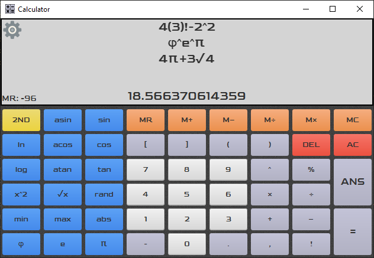

# Scientific Calculator
This is a project that uses Java and JavaFX to create and design a graphical scientific calculator. This calculator allows the user to edit and evaluate common math expressions. The evaluation process is modeled after PEMDAS and thus considers operator precedence and operator associativity.

## Features
| Feature                    | Supported          |
|:--------------------------:|:------------------:|
| PEMDAS                     | :white_check_mark: |
| Memory                     | :white_check_mark: |
| Named Functions            | :white_check_mark: |
| Named Constants            | :white_check_mark: |
| Resizable Window           | :white_check_mark: |
| Operation History          | :white_check_mark: |
| Editable Settings          | :x:                |
| Custom User Functions      | :x:                |

## Output

